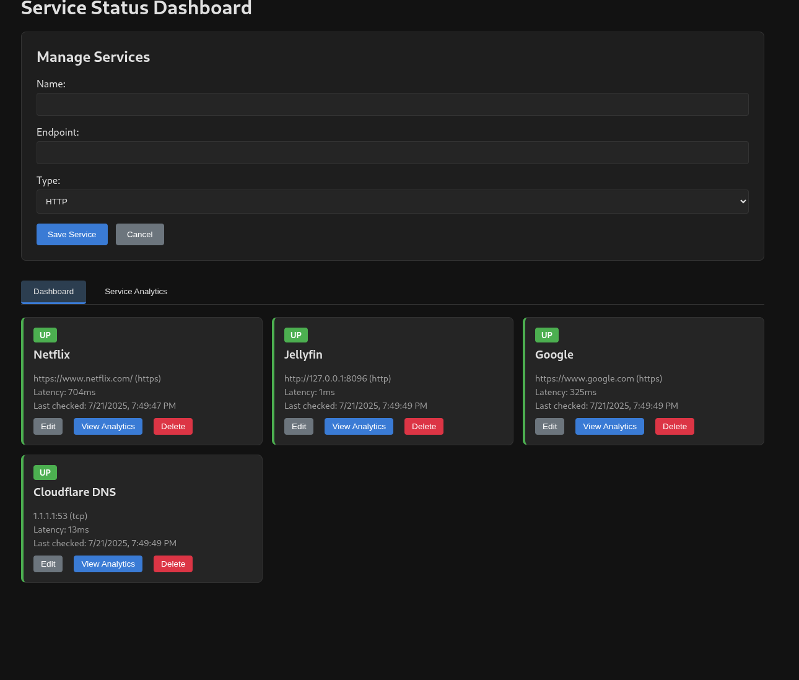
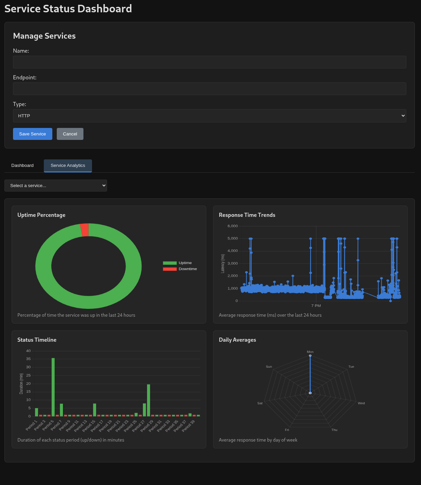

# uptime-dashboard
 Uptime dashboard for local and remote services.
 The web page is entirely incapsulated in the GO backend.
 This program is ment for monitoring of local services in a home lab mostly, and does not include multiple accounts or multiple dashboards, nor does it expect a login to access/modifiy data.

 

